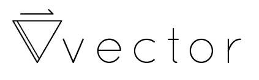

[](https://travis-ci.org/joseph-walker/vector)
[](https://coveralls.io/github/joseph-walker/vector?branch=master)
[](https://niceme.me/)

[Read the Docs](http://joseph-walker.github.io/vector/)

## The Elevator Pitch
Vector gives your functions superpowers.
It lets you autoload your functions with Composer without having to mess with autoloading individual files.
It allows you to automatically curry your userland functions with zero effort on your part.
It provides built-in memoization for abstracting away time-consuming pure operations.
It gives you useful helpers for composing simple functions into more complex ones and gives you the building blocks you need to make data manipulation easier than ever, all while maintaining a simple and declarative module loading system so your dependencies are always clear and concise.

## PHP Version Support
- 7.1 +

## Install
```
composer require vector/core
```

## Show Me Some Code
Autoloading Functions? A snap.
```
use Vector\Lib\Arrays;
```

Currying? Completely free.
```
$addOne = Arrays::map(function($a) { return $a + 1; });
$addOne([1, 2, 3]); // [2, 3, 4]
```

Memoization? Batteries included.
```
Class MyFunctions extends Module {
    protected $memoize = ['myFunction'];
}
```

Composition? No problem.
```
$addSix = Lambda::compose(Math::add(4), Math::add(2));
$addSix(4); // 10;
```

Pattern Matching? Of course. (For Maybe/Either see vector/functors)
```
Pattern::match([
    function (Just $value) {
        return function (string $unwrapped) {
            return $unwrapped;
        };
    },
    function (Nothing $_) {
        return function () {
            return 'nothing';
        };
    },
])(Maybe::just('just')); // 'just'
```
